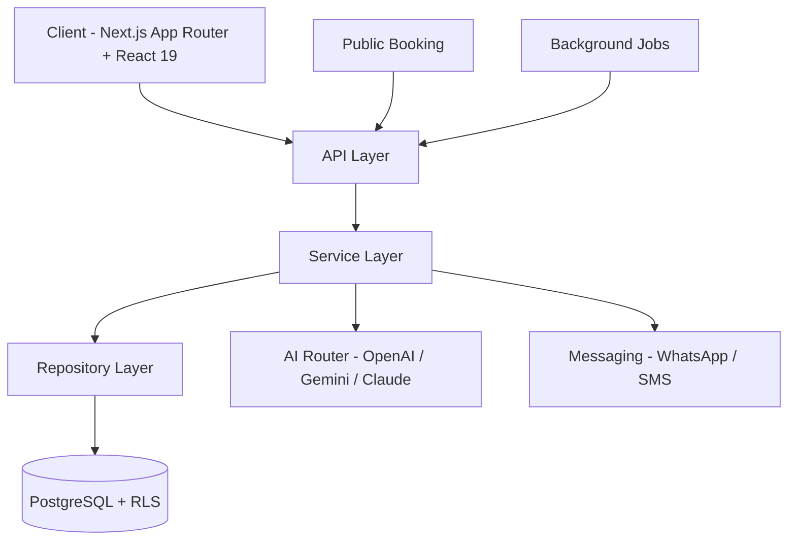

# ClinicFlow

### Clinic operations, automated.

Full-stack multi-tenant SaaS for clinics and appointment-based businesses.
Lead capture. Scheduling. Billing. AI-powered patient communication. One platform.

---

## Overview

ClinicFlow manages the full lifecycle of a service-based business:

> **Lead** → **Contact** → **Appointment** → **Patient** → **Returning Patient**

Every module connects to this flow. Leads are tracked from first touch through conversion. Appointments are scheduled with real-time availability. Patients accumulate revenue and visit history. Billing documents comply with Israeli tax law. Analytics reflect actual performance — not vanity metrics.

Hebrew-first RTL interface, timezone-aware scheduling (Asia/Jerusalem), ILS formatting, and Hebrew PDF generation.

Multi-tenant from day one — every record isolated at both the database and application layers.

---

## Product Modules

### Operations

- **Lead Management** — Status pipeline (pending → contacted → scheduled → closed), AI-computed urgency/priority, SLA deadlines, multi-source tracking
- **Customers & Patients** — Auto-computed status by visit recency, recall system, per-patient revenue tracking, bulk CSV/Excel import & export
- **Calendar & Scheduling** — Week/Day/Month views, service-colored appointments, slot locking, worker assignment, timezone-aware availability engine

### Revenue & Compliance

- **Billing & Documents** — 5 Israeli tax-compliant document types, VAT calculation, sequential numbering, Hebrew RTL PDF generation, 6 payment methods, full audit trail
- **Analytics & Reporting** — KPI cards with trend indicators, lead-to-close conversion funnel, revenue by service, configurable date ranges (1d / 7d / 30d / 90d / custom)

### AI & Communication

- **AI Business Automation** — Composable prompt pipeline classifies intent, extracts leads, and schedules appointments from natural language. Per-clinic model selection (GPT-4o / Gemini / Claude) with instant switching.
- **Multi-Channel Messaging** — SMS & WhatsApp via provider-agnostic abstraction (Twilio, Vonage). Campaign system with audience filtering, bulk sends, and flexible scheduling.

### Platform

- **Team & RBAC** — Three-tier access: platform admin, clinic admin, staff. User invitation and role management.
- **Settings** — Per-clinic config: working hours, scheduling rules, billing, AI behavior (tone, strategy, industry context, custom overrides), automation flags
- **Super Admin** — Multi-clinic oversight, per-clinic AI model management, booking site builder, integration monitoring
- **Public Booking** — Self-service wizard: service → worker → date → time → SMS OTP verification → confirmed. Gallery, products, and team bios per clinic.

---

## Key Workflows

### 1. Lead Capture → Patient Conversion

1. Lead enters via messaging channel, manual entry, or bulk import
2. AI scores urgency and priority, sets SLA deadline
3. Staff contacts the lead — status advances through the pipeline
4. Appointment booked — patient record created or linked by phone number
5. Revenue aggregated from billing documents onto the patient record
6. Patient status auto-computed from visit recency (active / dormant / inactive)
7. Recall system flags patients due for re-engagement

### 2. Appointment Scheduling & Lifecycle

1. Patient or staff selects a service and preferred time
2. Availability engine validates against working hours and existing bookings per worker
3. Selected slot locked with TTL to prevent double-booking during checkout
4. Appointment confirmed — enters scheduled state
5. Tracked through lifecycle: scheduled → completed / cancelled / no-show
6. Background job cleans up expired slot locks
7. Analytics updated with volume, completion rates, and no-show patterns

### 3. Billing Document Issuance

1. Staff selects patient and services rendered
2. System determines allowed document types based on business registration
3. Line items calculated with VAT at the effective rate
4. Sequential document number generated per type per year
5. Hebrew RTL PDF rendered and stored
6. Payments linked with allocated amount tracking across multiple methods
7. Every action audit-logged — issuance, viewing, download, cancellation, payment linkage

---

## Architecture

- **Layered separation** — Repositories for data access, services for business logic, route handlers for request/response only.
- **Multi-tenant isolation** — Clinic scoping enforced at both database (RLS) and application layers independently.
- **Per-request AI routing** — Model config read from DB on every request. No cache — admin changes take effect on the next message.
- **Channel-agnostic processing** — Same AI pipeline regardless of inbound channel. New channel = new webhook, not new logic.
- **Async webhooks** — External handlers return immediately; processing happens in the background.

---

## Tech Stack

| Layer | Technology |
| :--- | :--- |
| **Framework** | Next.js 16 (App Router), React 19, TypeScript 5 |
| **Styling** | Tailwind CSS v4, Framer Motion, dark mode, full RTL |
| **Database** | Supabase (PostgreSQL), Row-Level Security |
| **AI** | OpenAI, Google Gemini, Anthropic Claude — per-clinic via Vercel AI SDK |
| **PDF** | React-PDF with Hebrew RTL rendering |
| **Charts** | Recharts |
| **Messaging** | Twilio, Vonage — provider-agnostic abstraction |
| **Deployment** | Vercel, Vercel Analytics + Speed Insights |
| **Font** | Heebo (Hebrew + Latin) |

---

## Engineering Highlights

**Multi-Tenant Data Isolation** — Every record scoped by clinic. PostgreSQL RLS at the database level, explicit filtering at the application level. Two independent barriers — a defect in one doesn't expose cross-tenant data.

**Per-Clinic AI Model Config** — Each clinic selects its AI provider and model. Config read from DB per-request — no cache, no restart. Admin switches from GPT-4o to Claude, next message uses it.

**Composable Prompt Architecture** — System prompt assembled from independent segments: industry rules, conversation strategy, tone, pricing, custom overrides. Each segment testable and configurable per clinic.

**Appointment Slot Locking** — Time slots locked with TTL during checkout. Database unique constraint as final double-booking safeguard. Background job reclaims expired locks.

**Israeli Billing Compliance** — Five document types gated by business registration. VAT with effective date ranges. Sequential numbering per type per year. Independent rounding at each monetary step.

**Provider-Agnostic Messaging** — Twilio and Vonage behind one interface. Switching providers is a config change — zero code. Same abstraction for future providers.

**Hebrew RTL Throughout** — Logical properties (start/end), RTL-aware calendar grid, Israeli date and currency formatting, Hebrew PDF generation with Heebo font family.

**Auto-Derived Patient Intelligence** — Status computed from visit recency — never stored statically. Cancellation risk from no-show patterns. Balance from billing vs. payments. Always current.

---

## Security & Access Control

- **Three-tier RBAC** — platform admin (all clinics), clinic admin (own clinic), staff (scoped operations)
- **Tenant isolation** at both database (RLS) and application layers
- **CSRF protection** via origin validation on state-changing requests
- **SMS OTP verification** for public booking flows
- **Audit logging** on all billing operations
- **Bearer token auth** for webhook and integration endpoints

---

## Deployment

- **Vercel** — optimized Next.js hosting with edge network delivery
- **Background processing** — async webhook handling, scheduled slot lock cleanup
- **Monitoring** — Vercel Analytics + Speed Insights
- **Database** — managed PostgreSQL with migration-tracked schema

---

## At a Glance

| Product Modules | RBAC Tiers | AI Providers | Messaging | Doc Types | Payment Methods | Development Activity |
| :---: | :---: | :---: | :---: | :---: | :---: | :---: |
| **12** | **3** | **3** | **SMS / WhatsApp** | **5** | **6** | **215+ commits** |

---

### This repository is a product overview only.

The full source code is maintained privately.
Built, designed, and engineered as a solo full-stack project by **Yonatan Nakash**.

**Interested in a code walkthrough, architecture deep-dive, or live demo?**

[GitHub](https://github.com/joniso2) · [LinkedIn](https://www.linkedin.com/in/yonatan-nakash) · [Email](mailto:joniso152468@gmail.com)

